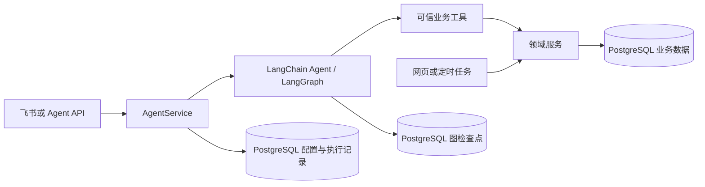

# Agent 运行时迁移设计

## 结论与边界

使用 LangChain `create_agent` 与 LangGraph 持久检查点作为嵌入式执行核心。FastAPI 仍是组合根，AgentService 拥有会话、配置、执行及人工确认业务，领域服务拥有业务规则与数据写入。

这是一个集成交付任务，按验证、数据基础、工具事务、运行时、入口、部署六个阶段推进。阶段产物彼此依赖，最终以同一业务操作的恢复闭环验收，故不拆成独立发布的子任务。

上述存储使用同一 PostgreSQL 实例；框架检查点和业务操作事务有不同连接与生命周期，不能假设跨连接原子提交。

## 数据与职责

| 数据 | 最小字段与规则 | 所有者 |
| --- | --- | --- |
| Agent 配置版本 | 单个经营助手；不可变 revision、指令、允许工具名称；模型引用继续使用 integrations | AgentService |
| 会话 | 外部会话 ID、内部 UUID、可信 owner/channel、模型 override、创建/更新时间 | Reven |
| 运行 | run ID、会话、请求去重键与输入摘要、配置快照、实际模型、状态、最终回复/错误码 | Reven |
| 工具操作记录 | `(run_id,tool_call_id)` 唯一、工具名、参数摘要/哈希、状态、已提交结果与业务 ID | 业务写入口 |
| 确认记录 | 确认 ID、run/tool_call、owner、规范化参数哈希、目标摘要、待办/批准/拒绝/消费状态 | AgentService + 写入口 |
| 图检查点 | 稳定 thread ID、消息、工具调用 ID、pending writes/interrupts、checkpoint version | LangGraph saver |

Reven 表由新增 Alembic 迁移管理；框架 saver 自有表按锁定版本的 `setup()` 管理，优先放入专用 schema。升级脚本负责初始化，不能在每个请求中建表。健康状态检查版本/连通性，不以业务数据库连通代替检查点就绪。

会话连续性使用稳定内部 UUID 对应 graph thread；每轮新 run 使用应用层执行 ID。严格区分新输入、普通中断恢复和 HITL `resume`，不能把恢复当成新用户消息或重铸会话 ID。

## 模型与配置

- 继续由 IntegrationCredentials 解密当前模型凭据，不复制 API key 到会话、配置快照、检查点或工具参数。
- `provider` 是现有路由标识而非协议证明。DeepSeek 官方选用已核实的官方 LangChain 适配器；标准 OpenAI 兼容路由使用对应客户端；未知映射明确拒绝。
- 保留当前 origin 校验，按已验证适配器处理 endpoint；不得为所有 provider 盲目拼同一路径。
- 验证 DeepSeek 推理字段在 AIMessage、工具结果、下一轮请求和检查点序列化中的保留；普通聊天可用不算工具协议通过。
- 候选 ChatDeepSeek 源码能保存响应中的 reasoning_content，但后续请求回传尚未证明；原生适配器只是起点。若 PoC 不满足协议，在明确 Provider 边界补最小消息适配并验证，不假称包名已保证兼容。
- 每轮开始读取模型注册表和配置 revision，固定本轮公开配置与指令。更新默认模型、Prompt、工具启用关系从下一新运行生效。
- 恢复固定原配置 revision 与已记录模型；当前模型不可用、工具已禁用或配置版本无法读取时明确失败，不静默换默认或改用当前版本。
- 模型删除保护覆盖未终止运行与待确认操作。历史快照或闲置会话不永久阻止删除；保留旧 override，下一轮明确提示不可用并允许用户显式恢复默认，不悄悄清除选择。
- 初期仅一个经营助手配置。提供严格的配置 GET/PUT API 和修订读取，不引入多 Agent catalog、动态代码载入或脚本数据库执行。

## 工具适配与事务

建立显式可信工具定义表：名称、输入 schema、bound async callable、是否写入、是否必须确认。原 37 个工具由同一注册定义派生 native LangChain 与需要保留的 MCP adapter，避免维护两份业务实现。

内部 Agent 优先直接异步调用，减少本机 HTTP 回环。actor、run ID、tool_call ID、有效确认由宿主注入，不能进入模型可编辑的输入 schema。工具参数中的逐字名称确认继续作为目标校验，不再承担用户批准证明。

25 个写工具必须经过相同操作入口。事务步骤：

1. 根据 `(run_id,tool_call_id)` 查找/锁定操作记录，校验名称和参数哈希。
2. 已完成则返回历史提交结果；同 key 不同输入明确拒绝。
3. 危险操作重新核对所属会话、当前发起资格、批准记录和目标归属。
4. 在一个 SQLAlchemy 事务中执行领域变更，并写入操作完成结果、批准消费状态。
5. 一次 commit；图保存 checkpoint 前发生中断，恢复时同 tool_call ID 仍取到已提交结果。

不能仅在现有内部 commit 外包日志。CRM/Talents 服务引入最小的外部事务接入方式；原网页调用保持默认提交行为，Agent 使用显式外部事务。工具实现允许注入已有 session，禁止模拟 session 或覆盖 commit 方法。RSS 关键词写入同样接入该事务边界。

RSS embedding 刷新是提交后的外部工作；记录关键词已保存与 embedding pending/ready，刷新失败沿用每日兜底，不回滚已保存关键词、不重做创建。人才画像导入的追加子项必须由同次操作账本保护，不能把“按同名更新”当作完整幂等。

MCP 通道即使保留，也不能绕过受保护写入口或把机器 Bearer 当作人的批准；无可信写入上下文的危险调用拒绝。

LangGraph ToolNode 可并行执行同一批工具；每会话保护不能替代同批保护。每个调用独立 AsyncSession，写入口按本轮调用顺序串行执行，读取可并行。不得跨并行调用共享 AsyncSession，也不能依赖上游总会遵守 parallel_tool_calls=false。

## 确认与恢复交互

- 8 个删除工具设置强制 HITL；工具启用配置不能关闭这条最低要求。
- 中断后建立确认待办，展示目标名称/ID、工具动作、级联影响和确认编号；模型不能自行批准。
- REST 新增确认 resolve 接口；飞书通过确定性的 `确认 <编号>` / `取消 <编号>` 解析，均不经过 LLM 判断批准意图。
- 待办默认保留至批准、拒绝或运行终止；不新增时间到期产品策略。目标、配置/工具兼容性或资格失效时明确拒绝，不能继续旧批准。
- resolver 校验发起身份与会话，并原子记录批准/拒绝。多工具确认时全部决策具备后才恢复对应 interrupt，避免错序批准。
- 批准不是鉴权替代；写入口再次校验并与业务 commit 一起消费。重复确认返回原结果，不启动第二次执行。
- 状态查询与显式恢复使用 run ID；普通中断采用继续已有图状态，人工确认采用 `Command(resume=...)`，禁止交叉混用。

## 并发、超时与中断

- 保持单 worker；提供每会话执行保护，跨会话可并发。不引入全局锁、Redis 或外部任务引擎。
- 主事件循环执行任务由应用生命周期持有；飞书 SDK handler 仍立即返回。message_id 作为去重键传入宿主，不能只用于回复。
- 等待确认或未完成写运行存在时，新业务写入不能抢跑；状态查询、确认和模型状态指令有确定性路径。
- 接口等待期限与执行期限分开。等待超时只告知当前运行编号和实际状态，不能把“停止等待”报成“写入失败”；既有 REST 错误结构保留，新增查询接口返回结构化状态。
- 进程重启将遗留 running 状态标为 interrupted；原用户明确恢复，且检查点/操作记录/配置可以对齐时才继续。缺少安全恢复依据则进入 needs_reconciliation，不自动重跑整轮。
- 并发中的同去重键附着原 run，不新建；同 key 不同 owner/session/input 返回冲突。去重只覆盖请求重发，不能吞掉不同消息的新意图。
- 每会话执行保护首期面向已承诺的单 worker；若使用 PostgreSQL advisory lock，必须持有独立连接并测试释放，不能在事务池里借用后误以为锁仍有效。

## 兼容与迁移

| 当前契约 | 本次变化 |
| --- | --- |
| REST chat 请求/成功 JSON | 保留；新增功能用附加接口和可选幂等请求头 |
| 飞书会话映射/白名单/引用回复 | 保留；新增明确确认、状态、恢复命令 |
| default 仅重启后生效、override 内存持有 | 改为新轮配置现读和数据库 override；执行中的身份保持快照 |
| DSH alias 重铸与磁盘状态 | 退役；新检查点稳定会话；旧卷归档，不自动导入旧历史 |
| checks.dsh 与镜像握手冒烟 | 改为 Agent/检查点就绪状态及 native runtime 冒烟；同步所有消费者 |
| HOME/DSH_HOME 可写卷要求 | 运行时移除依赖；旧卷不能被迁移或清理脚本删除 |
| startup Agent 失败、站点可降级 | 保留；业务库错误与 Agent 配置/检查点错误分别表述 |

旧 `agent-dsh-contract.md` 的进程内 override、无 resume、无同会话保护、同步 SDK、120s 兜底等描述属于旧实现；本次批准设计替代这些部分，其余业务语义继续遵守。实现后更新规范与文档，不能靠修改旧测试掩盖遗漏。

## 升级与回滚

- 先备份 PostgreSQL、模型加密配置和旧 dsh-data；新增迁移不删除业务或旧运行数据。
- 初始化应用表与 checkpointer schema，验证迁移权限；仅 Agent 初始化失败时业务页面可用，但 Agent 明确不可用。
- 新镜像锁定依赖，不再捆绑 DSH runtime；只读根目录、无 DSH_HOME 场景需要独立测试。
- 回滚采用旧镜像、旧 Compose 挂载及配置；保留新增表，不以破坏性 downgrade 或删卷恢复。回滚到 DSH 后新增 LangGraph 会话不会自动转入旧历史。
- 本任务交付代码、PR 与验证证据，不执行生产部署或合并。

## 主要风险与技术门槛

- LangChain/LangGraph 依赖近期更新，必须先锁版本验证，不直接跟随 latest。
- 多轮 DeepSeek 推理字段、HITL 重启和 PostgreSQL serializer 是首阶段技术门槛。
- 业务 commit 与操作结果必须同事务；只验证普通成功路径不能宣称恢复可靠。
- 图的 sync durability 能缩小检查点窗口，不能代替操作账本或每会话执行保护。
- 若最小事务改造破坏 REST 行为，先修复兼容，不扩大到财务/项目等无关模块。

## 证据

- `research/runtime-integration.md`：当前调用链、工具、事务、部署与测试边界。
- `research/langgraph-runtime-contract.md`：框架版本、API、检查点与模型适配契约及官方来源。
