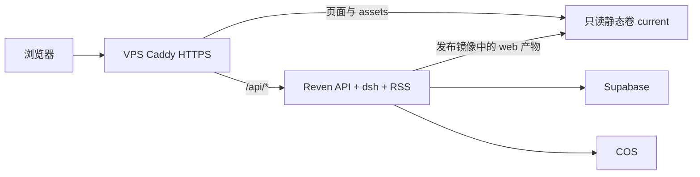

# 统一 VPS 部署设计

## 结论

恢复已存在的单镜像部署：Caddy 在 VPS 服务 React 静态产物并代理 /api；应用仍运行现有 API/dsh/RSS，数据库使用 Supabase，资产使用 COS。本次生产发布从已核实的 v0.7.1 制作部署补丁，不带 main 的业务迁移。

## 架构与请求边界

- /api/*：独立 handle 反代 reven:8000，不进入 SPA fallback。
- /agent/*：独立 handle 返回 404，维持内部 MCP 隔离。
- /assets/*：root /srv/reven/current + file_server，immutable 一年缓存；无 try_files，缺失资源 404。
- 其它页面：同 root，try_files 到 /index.html，no-cache；保留安全响应头、HTTPS 与当前 HTTP 3001 过渡入口。
- reven-static 原卷保留，应用读写、Caddy 只读；不清空卷、不重置属主、不提高容器权限。
- 前端使用原相对 /api 客户端，不改 API base URL 或 CORS。PUBLIC_BASE_URL 已为 VPS HTTPS；CSRF 与 Cookie 功能不改，旧 Vercel 白名单保留作过渡回退。

## 代码主线与生产基线

| 工作 | 基线 | 产物与约束 |
| --- | --- | --- |
| 长期部署修复 | 最新 origin/main | codex/unify-vps-deploy，走 PR 合并 main，仅部署/测试/文档/规范改动，不修改业务代码。 |
| 本次生产补丁 | v0.7.1 / 2066c3c | codex/unify-vps-deploy-hotfix，回移审阅后的部署修复，并仅带 release.yml 的 gha 缓存修复；不带 #207。 |
| 发布 | 补丁分支最终 commit | 未占用的 v0.7.2 tag；现有 tag workflow 构建、full gate、扫描、SBOM、ACR digest 部署。 |

用户选择选项 1 已明确批准一次基于线上版本的补丁分支例外。不得把补丁分支整个合并回 main、回退 main 的业务改动，或让 tag 指向 main 的较新业务提交；主线已经持有相同部署修复。

应用源码、前端业务源码、迁移、依赖与 lock files 相对 v0.7.1 必须无差异。只需修改现有发布 cache 配置；现有 runtime/CVE 修复已在 v0.7.1 中，不回退、不绕过扫描门禁。不建立额外镜像流水线，不临时手改服务器 infra 来掩盖源码/镜像不一致。

## 验证设计

1. 本地结构/回归验证生产静态路由、共享 ro 卷、backend filter 和 full-only 容器门禁。
2. 扩展既有 self_host_smoke 与 HTTP Browser：保留现有 self-host 验收，并增加生产 Caddy 路由阶段。生产阶段以正式 infra/compose/docker-compose.yml 为基底，只复用已渲染的隔离 PostgreSQL 服务与应用 environment/depends_on；最终测试覆盖清空生产 env_file、指定本地 reven:test 和 loopback 8443。Caddy 只替换顶层公网站点为 localhost/internal TLS，真实 site_common 保持不变，不请求公网 ACME。
3. 真实 HTTP 验证首页/深链接/index 一致性、实际 JS/CSS MIME/缓存、缺失 assets、内部 MCP、API/认证/CSRF、安全头；docker inspect 核对共享卷的 RW 属性。
4. main 与补丁分支分别执行原生 Linux AMD64 full CI；补丁运行的迁移 head 必须为 0024。Mac/ARM 仿真不能替代该证据。
5. 上线后验证可信公网 TLS、页面加载、同源登录和业务只读页面；核对当前 digest、静态 release 与 DB revision。隔离 fixture 不写入生产数据库。

## 切换顺序

1. 实施审批后完成 main 修复及评审，通过 PR 保留长期配置。
2. 建立补丁分支并回移经过审阅的部署变化；源码差异门禁与实际补丁 full CI 通过。
3. 发布前再只读核对线上仍是已确认 digest/数据库 0024、现有 Vercel 回退入口仍可用、健康镜像历史可恢复。若状态被其它部署改变，停止本补丁上线，重新评估，绝不降级 schema。
4. 推送新 tag，沿用现有 release workflow。它会从新镜像导出 matching infra，再重建容器、健康检查与 Caddy reload；不在服务器 build。
5. 完成 VPS 页面/API/真实登录与 DB revision 验收后，确认停止 Vercel 日常自动发布，记录入口与发布证据。已核实旧项目由 CLI 发布、当前无 Git 连接，因而没有日常 Git 自动发布；web/vercel.json 中 git.deploymentEnabled=false 仅在配置实际被项目读取时生效（未来 root=web 的 Git 集成）。保留旧部署，不用仓库配置代替平台核查。

## 回滚与兼容性

- 原始 digest 固定为 sha256:067d44f6d0698f61e7f2ee182d05b2b2b57a349d6a5fe0c472a940c600f390d7，使用已有受限脚本按该 digest 部署，配套 infra 一起恢复。
- 回滚恢复原 API + Vercel 形态；VPS 根页面将再次 404，用户回到旧 Vercel 域。保留旧项目、Origin 白名单与其可用性是本次故障恢复策略的一部分。
- 本次没有 schema 变化，回退相同业务版本不需要 DB downgrade。应用入口仍会执行幂等 upgrade head，必须保证目标 head 为 0024。
- 脚本自动恢复 infra/env 并不等于已恢复应用；失败后仍按既有规则核对实际容器与入口，不伪造健康状态。
- 本次不下线 3001、不增加 HSTS、不改变其它 VPS 服务端口。

## 范围外

业务功能发布、0025/0026、数据库/COS 迁移、Vercel 历史项目删除、dsh 升级与 serverless 适配均不包含。后续 main 发版应单独处理业务迁移与版本说明；不要把本次补丁 tag 当作 main 已全部上线。
