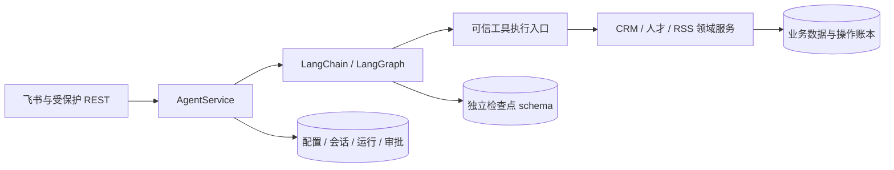

# Reven Agent 架构

Agent 使用原生异步 LangChain `create_agent`（底层 LangGraph）与 PostgreSQL 检查点，嵌入现有 FastAPI 单体。Agent 配置、会话、模型选择、运行结果与删除确认均由数据库管理，不需要本地 Workspace 或 DSH 子进程。本文描述迁移后的代码契约，不代表已部署到生产。

迁移前说明保存在 [DSH 架构快照](history/agent-dsh-architecture-20261006.md)，仅用于历史核对和旧镜像回滚。

## 执行与存储



业务存储使用 SQLAlchemy/asyncpg，框架检查点使用独立 psycopg 异步连接池，位于固定 `reven_agent_checkpoints` schema。它们有独立事务，不能假设业务 commit 与检查点原子提交。

每轮固定配置版本及实际模型，内部会话 UUID 对应稳定 graph `thread_id`。新输入、普通中断恢复、人工确认恢复分别处理；不能通过新建会话或重复追加用户消息“恢复”。图调用使用 `durability="sync"`，业务操作账本仍用于弥补提交与检查点之间的窗口。

## 工具与可信确认

现有 RSS 4、CRM 15、人才 18 个工具共 37 个。显式定义表统一描述名称、输入 schema、调用函数、写入属性与确认要求，native 与 MCP 适配复用同一业务实现；内部 Agent 直接异步调用。

模型只提供业务参数。宿主构造 `AgentContext(owner_id, session_id, run_id)`，框架提供 `ToolRuntime.tool_call_id`，这些字段不进入模型输入 schema。

25 个写工具在一次 SQLAlchemy 事务中校验身份、执行领域变更、写入已提交结果并消费批准。`(run_id, tool_call_id)` 唯一且绑定工具名与规范化参数哈希。重放返回旧结果，不重复追加客户跟进或人才子项。CRM/人才网页调用保留原提交行为，Agent 显式参与外部事务。RSS 关键词先与操作结果提交，再刷新 embedding；失败返回 `pending`，补刷不重新创建关键词，每日兜底保持。

8 个删除工具强制暂停，展示数据库核实的目标名称、ID、级联影响及确认编号。逐字名称参数只校验目标，不证明用户批准。批准记录绑定原用户、会话、运行、调用 ID、工具及参数，执行端在写事务再次核实并消费。配置不能关闭最低确认要求，机器 MCP Bearer 也不能证明人的批准。

同会话只允许一个未结束运行，同批写入按调用顺序串行，每个工具拥有独立 AsyncSession；读取可并行，不跨并行调用共享 Session。不同会话可并行，部署仍限定单 Uvicorn worker。

## 入口、配置与恢复

`POST /api/agent/chat` 保持原 `message`、可选 `session_id` 和成功响应 `{session_id,response}`。可选 `Idempotency-Key` 处理请求重发：同键附着原运行，同键不同输入或会话冲突。新增配置、修订、历史、运行、批准/拒绝与恢复接口沿用管理员登录及 CSRF。可信 REST actor 由认证边界注入，客户端不能指定。

飞书在所有回复前现读白名单，保留 `feishu:{chat_id}:{open_id}` 会话映射与引用回复，`message_id` 用于运行去重。`确认 <编号>` / `取消 <编号>`、运行状态及恢复指令直接进入服务，不经过 LLM 判断。重复确认返回原状态，多工具暂停收齐对应决策后再恢复。

`/model list`、`/model current`、`/model use provider/model` 延续，override 入库。默认模型、Prompt 与工具配置从下一轮新运行生效，执行中和待恢复运行保留原快照。指定模型失效时明确报错并保留选择，用户显式恢复默认，不静默换模型。模型删除只保护未结束运行或待确认操作，闲置历史不会永久阻止删除。

应用持有异步执行任务；HTTP/飞书停止等待不等于业务未执行。等待期限与执行期限分开，超时告知运行编号及状态，应查询原运行而非直接重试。启动将遗留 `running` 标为 `interrupted`。原用户显式恢复时重新核对配置、模型、工具、检查点与账本：普通中断继续已有图状态，HITL 使用对应 `Command(resume=...)`。缺少安全依据则标为 `needs_reconciliation`，不重跑整轮。

关闭时停止入站、收敛 Agent 执行任务和检查点池，再释放共享客户端及数据库资源。Agent 未配置或初始化失败可让站点降级；业务数据库异常单独报告。站点 HTTP 200 不证明 Agent 工具执行与恢复正常。

## 模型与凭据

模型仍由 `agent-llm` 集成注册表管理，`IntegrationCredentials` 解密。API key 只用于临时创建模型客户端，不写配置版本、运行快照、图状态或工具参数。DeepSeek 官方专用适配器保证工具后的 `reasoning_content` 回传；标准 OpenAI 兼容端点使用明确支持的路由，未知协议或失效模型明确失败。

已有 `AGENT_API_KEY`、`AGENT_PROVIDER`、`AGENT_MODEL`、`AGENT_BASE_URL` 回退保留，endpoint 继续校验 HTTPS origin。执行期限为 `AGENT_RUN_TIMEOUT_SECONDS`。检查点使用严格 msgpack，禁止任意对象的不安全反序列化回退。

## 初始化、升级与回滚

在显式目标数据库上依次执行：

```bash
uv sync --frozen --all-packages --python 3.12
uv run alembic -c server/migrations/alembic.ini upgrade head
uv run python -m reven.agent.checkpoint
```

初始化命令只读 `DATABASE_URL` 环境变量，不自动读任意 `.env`，不打印 DSN。镜像 entrypoint 在启动锁中迁移应用表及检查点，再切换静态资源；失败不发布新版静态资源，请求中不运行 `setup()`。

新版 Compose 不挂载 `dsh-data`，不设置 `DSH_HOME` 或修改 `HOME`。旧 named volume 保留，升级前用旧容器备份它，并保存旧镜像和 Compose。新运行时开始新对话，业务数据和加密模型配置延续，不自动导入 DSH 历史。

回滚使用旧镜像与旧挂载，保留新增表、检查点和业务记录，不执行破坏性 downgrade 或删卷。新版对话不能自动转回 DSH。完整备份包含数据库、主密钥、应用文件及原版本配置，见[自托管运维](self-hosting-operations.md)。RSS 调度、素材审核、提醒与经营网页继续调用领域服务。

## 验证边界

确定性模型、HTTP 协议替身、真实 PostgreSQL 和真实模型证据分别记录。核心验收包括工具 schema/业务规则、持久批准、去重、提交后中断不重复写、跨应用恢复、模型选择、同批写序、独立会话并发、迁移与只读容器。

真实模型验证仅使用隔离数据或假业务工具。没有安全凭据时明确记录未验证，不能以模型替身或纯文本回复冒充真实工具协议验证。
