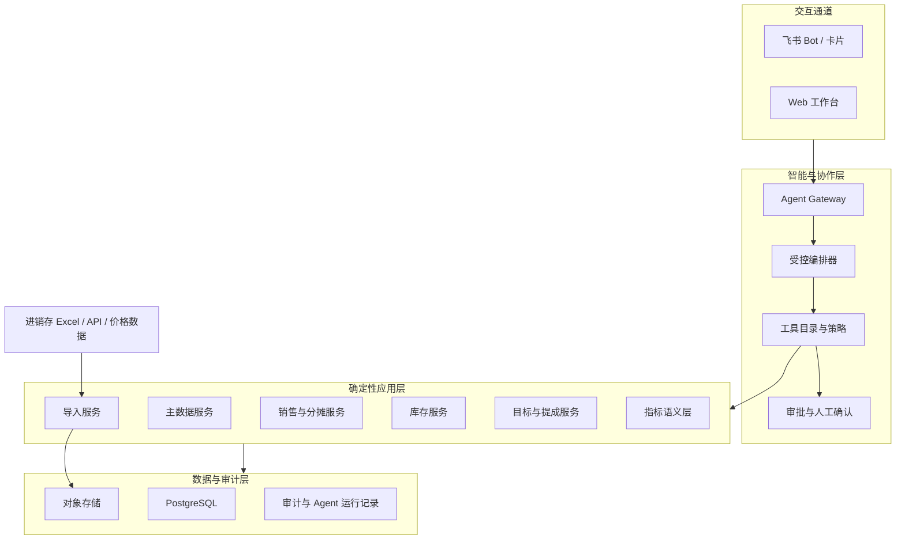

# AI 原生家电零售经营平台规格书

> 版本：v2.0
> 日期：2026-07-19
> 状态：详细设计参考，产品范围以 PRD 为准
> 上位文档：[产品主故事线](./product-storyline.md)、[五阶段 PRD](./prd.md)
> 关联文档：[OpenClaw Workspace 深度诊断](./workspace-analysis.md)、[弹性 Excel 导入工作台设计](./flexible-excel-import-design.md)、[用友渐进替代与可扩展架构](./yonyou-replacement-architecture.md)、[远期产品路线](./future-product-roadmap.md)

## 1. 产品结论

本项目以最终替代现有用友为长期目标，但不采用一次性重建和切换。平台先作为“AI 原生经营与操作层”，再按业务域逐步成为新的记账主系统：

- 过渡期由用友负责尚未迁移模块的开单、记账和基础事实。
- 新平台先负责数据标准化、经营指标、异常队列、决策建议和协作闭环。
- 销售、库存、采购、结算和财务按独立验收门槛逐模块接管。
- Agent 负责理解问题、检索证据、解释原因、生成方案和发起受控动作。
- 确定性业务服务负责金额、库存、提成、权限、状态转换和数据库写入。

第一阶段成功不以页面数量衡量，而以数据可信度和处理闭环衡量。

## 2. 假设与产品边界

### 2.1 当前假设

1. Excel 格式短期内继续变化，用户不能被强制要求统一模板。
2. 飞书仍是高频入口，Web 用于复杂查看、纠错、配置和审批。
3. 现有用友的具体产品版本、已购模块和接口能力尚未确认，短期仍以文件导入为主。
4. 初始用户来自一个经营主体，但数据模型需要支持未来多租户。
5. 销售、库存、商品、价格和提成是当前证据最充分的领域。

### 2.2 MVP 范围

| 领域 | MVP 能力 |
|---|---|
| 数据接入 | 持续变化的 Excel 上传、模板识别、映射、纠错、对账、幂等导入 |
| 商品 | SKU、型号、品牌、品类、别名、UPC、序列号映射 |
| 销售 | 销售/退货事实、门店/人员归属、组合销售分摊 |
| 库存 | 库存快照、可用量、在途、负卖、滞销与库龄分析 |
| 目标 | 月度目标、分组和个人完成率、差距预测 |
| 提成 | 规则与底表版本、未匹配治理和试算 |
| 智能助手 | 自然语言查询、异常解释、方案草稿、飞书协作 |
| 治理 | 租户隔离、RBAC、审批、数据血缘、审计和隐私保护 |

### 2.3 MVP 暂不承诺

- 财务总账、应收应付和税务核算。
- 完整采购、供应商结算和采购退供。
- 配送、安装、维修和售后全流程。
- 会员营销、商城或 POS 替换。
- 允许 Agent 直接执行调价、库存调整或结算。

这些模块需要先完成业务调研和数据源确认，不能从当前 workspace 推断实现。

## 3. 设计原则

### 3.1 事实、规则和解释分离

```text
事实：原始单据、销售明细、退货、库存流水、库存快照
规则：组织归属、滞销策略、提成政策、指标定义
解释：Agent 对指标和异常的自然语言说明
```

事实不可被报表逻辑覆盖；规则必须版本化；解释必须引用事实和规则。

### 3.2 原始数据不可变

- 原始文件、Sheet 和单元格值按导入批次永久留痕。
- 用户纠错形成修正记录，不覆盖原始值。
- 正式业务事实通过重新标准化产生。
- 导入、修正、撤销和重算都需要审计。

### 3.3 Agent 不能绕过业务服务

- Agent 只能调用已登记的查询和命令工具。
- 禁止模型执行任意 SQL 或直接更新数据库。
- 所有命令具备权限检查、幂等键、状态机和审计记录。
- 高风险动作必须先生成草稿，再由有权限的人确认。

### 3.4 先建立可信数据，再追求智能

没有对账和数据血缘时，语言模型给出的“洞察”不可作为经营决策依据。所有智能能力必须建立在指标语义层之上。

## 4. 目标用户与核心任务

| 角色 | 主要任务 | 默认权限 |
|---|---|---|
| 老板/经营者 | 查看经营状态、审批、追问原因、分配任务 | 全局读、关键审批 |
| 店长 | 查看门店、处理异常、追踪目标和库存 | 本门店读写 |
| 组长 | 查看本组、跟进目标和滞销任务 | 本组读、有限操作 |
| 导购员 | 查看个人业绩、处理归属异常 | 本人数据 |
| 财务/核算 | 对账、维护底表、复核提成试算 | 财务域读写 |
| 数据管理员 | 导入、映射、主数据和规则维护 | 数据治理权限 |

### 4.1 第一入口：今日经营工作台

首屏不是装饰性 Dashboard，而是按优先级排列的工作队列：

1. 导入失败、金额差异和疑似重复。
2. 负库存、即将缺货和在途不足。
3. 高库龄、零动销和滞销任务。
4. 目标完成风险和异常波动。
5. 提成未匹配和待确认分摊。
6. Agent 给出的待审批方案。

每个异常必须能下钻到原始文件、原始行、标准单据、命中规则和负责人。

## 5. 总体架构



### 5.1 组件职责

| 组件 | 职责 | 明确不做 |
|---|---|---|
| 导入服务 | 解析、映射、校验、去重、标准化、对账 | 不生成经营解释 |
| 主数据服务 | SKU、别名、组织和人员归一 | 不隐式猜测并落库 |
| 业务服务 | 事实入库、状态变化、分摊和试算 | 不调用 LLM 计算金额 |
| 指标语义层 | 统一指标口径和查询 | 不允许页面各写一套 SQL |
| Agent Gateway | 身份、上下文、工具调用和流式输出 | 不直接访问业务表 |
| 受控编排器 | 查询、诊断、草稿和确认 | 不承载 ERP 交易状态 |
| 审批服务 | 高风险动作确认、撤回和审计 | 不接受模型代替用户确认 |

## 6. Agent 设计

### 6.1 第一阶段采用单编排器

MVP 使用一个受控编排器，根据意图调用不同工具。暂不拆分多个自治 Agent，避免上下文、权限和责任边界复杂化。

MVP 直接使用模型 SDK、工具目录和数据库状态机。只有出现至少三步、需要跨会话恢复并包含分支补偿的 Agent 流程时，再评估 LangGraph；LangChain 不作为前置依赖。普通 CRUD、计算和状态转换始终留在确定性业务服务中。

### 6.2 能力类型

| 类型 | 示例 | 风险级别 | 执行方式 |
|---|---|---:|---|
| 指标查询 | “昨天两个门店卖了多少？” | 低 | 自动执行 |
| 解释诊断 | “空调销量为什么下降？” | 低 | 自动查询并引用证据 |
| 方案生成 | “给出本周滞销处理方案” | 中 | 生成草稿 |
| 任务创建 | “把这些型号分配给各组跟进” | 中 | 预览后确认 |
| 补货建议 | “根据库存和销量生成补货单” | 高 | 草稿 + 审批 |
| 提成试算 | “试算本月提成” | 中 | 生成试算与未匹配清单，人工复核 |

### 6.3 工具契约

每个工具至少定义：

- 工具用途和不适用场景。
- 输入 Pydantic Schema。
- 调用者角色和数据范围。
- 幂等键策略。
- 风险等级和审批要求。
- 结构化输出及证据引用。
- 超时、错误码和重试策略。
- 审计字段和脱敏规则。

### 6.4 查询约束

- 结构化交易数据通过指标 API 或受限查询 DSL 获取。
- RAG 仅用于政策、说明书、规则文档等非结构化内容。
- 不允许模型生成任意 SQL 后直接执行。
- 回答中的数字必须携带指标定义版本、时间范围和来源批次。
- 无法确认口径时必须返回澄清或异常，不能静默猜测。

### 6.5 提示注入防护

- Excel、附件、备注、客户文本和历史记忆一律标记为不可信数据。
- 数据内容不能覆盖系统提示、权限策略或工具规则。
- 工具参数只接受结构化校验后的字段。
- RAG 文档按来源和权限过滤，返回内容与指令分区。
- 高风险工具不接受附件文本直接触发。

## 7. 领域模型

### 7.1 租户、组织和权限

| 实体 | 关键字段 |
|---|---|
| `tenant` | 租户、状态、默认时区 |
| `org_unit` | 门店、部门、销售组、上下级关系 |
| `employee` | 员工、飞书身份、状态 |
| `employee_assignment` | 员工与组织关系、有效期 |
| `role` / `permission` | 功能权限 |
| `data_scope` | 全局、门店、组、本人 |

人员分组不能保存在单个 JSON 配置中，必须通过有效期支持历史归属重算。

### 7.2 商品主数据

| 实体 | 作用 |
|---|---|
| `product` | SPU 层商品概念 |
| `sku` | 可库存和交易的具体型号 |
| `product_alias` | 不同来源的名称、编码和匹配状态 |
| `product_identifier` | UPC、厂商编码、平台编码 |
| `serialized_item` | 单台序列号及当前状态 |
| `category` / `brand` | 版本稳定的分类和品牌 |

商品匹配顺序应为来源编码、UPC、确认别名、标准化型号、人工确认，不能长期只靠名称模糊匹配。

### 7.3 文件与数据血缘

| 实体 | 作用 |
|---|---|
| `source_file` | 文件名、哈希、存储位置、上传者 |
| `import_batch` | 文件类型、模板版本、状态、汇总 |
| `source_sheet` | Sheet 元数据和识别结果 |
| `raw_row` | 原始行 JSON、行号和单元格位置 |
| `normalization_revision` | 标准化版本和修正记录 |
| `validation_issue` | 行级/批次级异常及处理状态 |

详细状态机和字段映射见[弹性 Excel 导入工作台设计](./flexible-excel-import-design.md)。

### 7.4 销售、退货和分摊

| 实体 | 作用 |
|---|---|
| `sales_document` | 销售、退货、换机等单据头 |
| `sales_document_line` | 商品、仓库、数量、单价、金额 |
| `document_relation` | 退货与原销售、换机正负单关系 |
| `sales_credit_allocation` | 一条销售明细分配给一至多名业务员 |
| `allocation_policy_version` | 分摊规则、有效期和发布状态 |

关键约束：

- 原始业务员字段和分摊结果分开保存。
- 分摊金额合计必须等于单据明细金额。
- 负数退货不得被过滤。
- 每次重算生成新 revision，不覆盖已发布版本。

### 7.5 库存

| 实体 | 作用 |
|---|---|
| `warehouse` | 仓库、类型和组织归属 |
| `inventory_snapshot` | 某时点现存、可用、在途和待出 |
| `inventory_movement` | 入库、出库、调拨、退货等流水 |
| `inventory_reservation` | 预占和释放 |
| `inventory_alert` | 基于规则生成的异常实例 |
| `disposition_task` | 滞销、残机和异常库存处理任务 |

快照用于回答“现在有多少”，流水用于解释“为什么变成这样”，二者不能互相替代。

### 7.6 目标、价格和提成

| 实体 | 作用 |
|---|---|
| `sales_target` | 期间、组织/人员、目标及版本 |
| `price_observation` | 来源、SKU、价格、有效时间 |
| `cost_basis` | SKU 成本及有效期 |
| `commission_policy_version` | 规则版本、有效期和审批状态 |
| `commission_calculation` | 试算批次和输入版本 |
| `commission_result` | 人员/明细结果、异常和试算状态 |

MVP 仅支持提成试算、对账和未匹配治理。正式结算只有在权威底表、匹配率和财务流程均通过专项验收后才立项，届时另行设计审批、锁定与重开能力。

### 7.7 智能运行与审计

| 实体 | 作用 |
|---|---|
| `agent_run` | 用户、意图、模型、提示版本、结果状态 |
| `tool_call` | 工具、结构化参数、证据、耗时和错误 |
| `action_draft` | Agent 生成的业务操作草稿 |
| `approval_instance` | 审批人、决定、时间和意见 |
| `audit_event` | 人和系统产生的关键变更 |

## 8. 指标语义层

禁止前端、飞书 Bot 和 Agent 分别实现销售额逻辑。所有经营数字必须从统一指标注册表产生。

每个指标包含：

- 指标名称和业务定义。
- 维度、过滤项和聚合方式。
- 退货、赠品、外机、返利等处理口径。
- 生效时间和版本。
- 可见角色和脱敏级别。
- 对账样本和自动化测试。

首批指标：

| 主题 | 指标 |
|---|---|
| 销售 | 净销售额、销量、客单价、退货额、分摊业绩 |
| 空调 | 内机净套数、品牌、柜挂机、型号和价格段 |
| 库存 | 现存、可用、在途覆盖、负卖、库龄、周转 |
| 滞销 | 滞销 SKU、动销率、处理任务完成率 |
| 目标 | 完成率、进度差、日均需完成、趋势预测 |
| 提成 | 匹配率、试算金额、异常金额、治理状态 |

## 9. Web 与飞书体验

### 9.1 Web 信息架构

```text
/workbench                 今日经营工作台
/imports                   文件导入与纠错
/sales                     销售、退货和业绩归属
/inventory                 库存、在途和异常
/products                  商品主数据和别名
/targets                   目标与进度
/commissions               提成试算与异常治理
/actions                   Agent 草稿、任务和审批
/settings                  组织、规则、权限和集成
```

### 9.2 交互原则

- 先展示待处理事项，再展示汇总趋势。
- 所有数字支持下钻到单据和原始文件。
- Agent 入口跟随当前页面上下文，但始终显示查询范围。
- 批量修正规则在应用前显示影响行数和金额。
- 高风险操作使用明确确认页面，不在聊天气泡中一键完成。
- 移动端优先处理查看、确认和指派；复杂映射留在桌面端。

### 9.3 飞书入口

飞书承担：

- 接收文件并返回导入状态。
- 推送高优先级异常和待审批任务。
- 回答低风险经营查询。
- 展示摘要卡片并跳转 Web 证据页。
- 接收简单确认，但高风险操作仍跳转完整审批页。

## 10. API 与命令边界

### 10.1 查询 API

```text
GET /api/v1/workbench
GET /api/v1/metrics/query
GET /api/v1/sales/documents
GET /api/v1/inventory/snapshots
GET /api/v1/inventory/alerts
GET /api/v1/products/match-issues
GET /api/v1/commissions/calculations/{id}
GET /api/v1/imports/{id}/lineage
```

### 10.2 命令 API

```text
POST /api/v1/imports
POST /api/v1/imports/{id}/confirm
POST /api/v1/imports/{id}/supersede
POST /api/v1/product-aliases/confirm
POST /api/v1/allocations/recalculate
POST /api/v1/disposition-tasks
POST /api/v1/commissions/calculate
POST /api/v1/commission-match-issues/{id}/resolve
POST /api/v1/action-drafts/{id}/approve
```

所有命令要求：租户上下文、操作者、幂等键、期望版本和明确错误响应。

## 11. 技术基线

| 层 | 建议 | 说明 |
|---|---|---|
| 数据处理 | Python、pandas/openpyxl | 复用现有技能，使用 `uv` 管理依赖 |
| 后端 | FastAPI、Pydantic、SQLAlchemy、Alembic | 结构化工具契约和迁移管理 |
| 数据库 | PostgreSQL | 关系事实、JSONB 原始行、应用层租户过滤 |
| 文件 | S3 兼容对象存储 | 原始文件不可变、哈希去重 |
| 前端 | Next.js、TypeScript | 使用 `pnpm`，表格采用成熟数据网格组件 |
| Agent | 模型 SDK + 工具目录 + DB 状态机 | LangGraph 达到复杂流程触发条件后再评估 |
| 可观测性 | OpenTelemetry + 结构化日志 | 关联导入、业务命令和 Agent Run |

MVP 使用边界清晰的模块化单体和后台 Worker。只有当导入并发、长任务或跨系统事务达到真实瓶颈后，再引入 Redis、Temporal 或拆分微服务。

## 12. 安全与合规基线

### 12.1 必须先完成

- 轮换 workspace 中暴露的飞书应用凭据。
- 删除代码中的硬编码密钥，改用环境变量或密钥管理服务。
- 增加 `.gitignore`、提交前 secret scan 和业务数据保护规则。
- 原始文件加密存储，下载使用短时签名 URL。
- 电话、地址等字段默认脱敏并按角色授权查看。

### 12.2 首发租户策略

- 首发按单租户部署和验收，所有业务实体保留 `tenant_id`；应用服务统一注入并校验租户上下文，禁止调用方自行指定越权租户。
- 文件对象路径和 Agent 检索空间按租户隔离。
- 后台任务必须显式携带租户上下文。
- 复杂 RLS 在 SaaS 多租户需求成立并完成威胁建模后启用。

## 13. 验证策略

### 13.1 黄金数据集

从历史纠错案例建立不可变测试集，至少包含：

- 正负单抵扣和当天退货重购。
- 二人组、三人组、负数分摊和商品说明混入备注。
- 空调内外机配对、旧机和零金额外机。
- 商品别名、型号近似和同名不同 SKU。
- 新到货与死库存的时间边界。
- 在途覆盖、调拨和 3 号残机库。
- 重复文件、累计文件和损坏文件。

旧脚本输出只能作为参考，最终期望值必须由业务人员确认。

### 13.2 验收指标

| 目标 | 门槛 |
|---|---|
| 幂等导入 | 同一文件重复上传不重复记账 |
| 金额对账 | 原始、标准化、分摊三层差异为 0 |
| 数据血缘 | 100% 指标可追溯到规则和原始行 |
| Agent 可信度 | 数字回答 100% 携带查询范围和证据 |
| 高风险操作 | 100% 经权限校验和人工确认 |
| 回归 | 黄金案例全部通过后才允许发布规则 |

## 14. 交付路线

### 阶段 0：安全与事实基线

- 轮换凭据并建立数据保护规则。
- 建立黄金样本和业务口径决策记录。
- 确认首个租户、角色和数据范围。

退出条件：关键历史差异都有业务确认的期望结果。

### 阶段 1：弹性导入与标准模型

- 文件上传、哈希去重和对象存储。
- 表头识别、映射模板、平台表格纠错和对账。
- 销售、退货、分摊、商品、库存基础模型。
- 历史数据批量导入及差异报告。

退出条件：销售净额和分摊金额稳定对账，重复导入为零。

### 阶段 2：经营工作台与统一指标

- 今日待处理队列。
- 销售、库存、滞销、目标和提成指标。
- 单据、规则、原始行全链路下钻。
- 飞书异常通知和摘要卡片。

退出条件：用户不再依赖临时脚本生成核心日报。

### 阶段 3：只读经营 Agent

- 自然语言指标查询。
- 异常归因和历史对比。
- 规则文档检索和证据引用。
- Agent 评测集、工具审计和提示注入测试。

退出条件：关键问题回答通过离线评测和业务验收。

### 阶段 4：操作闭环

- 滞销任务、分摊修正和提成异常治理流程。
- 权限、审批、确认、撤销和审计。
- Agent 草稿与责任人协作。

退出条件：至少一条业务线从发现问题到处理完成全程留痕。

### 阶段 5：用友模块接管与范围扩展

- 通过防腐层同步用友，逐步减少 Excel。
- 依次接管销售、库存、采购、结算和财务模块。
- 每个业务域切换后停止该域双写，并保留回退与对账能力。
- 详细路线和退出门槛见[用友渐进替代与可扩展架构](./yonyou-replacement-architecture.md)。
