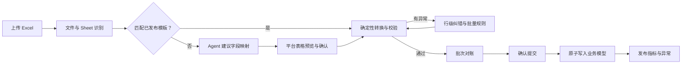

# 弹性 Excel 导入工作台设计

> 版本：v1.0
> 日期：2026-07-19
> 状态：详细设计基线
> 上位文档：[AI 原生家电零售经营平台规格书](./erp-platform-spec.md)

## 1. 结论

平台不要求用户先统一 Excel，而是在系统边界吸收格式变化：

> 持续变化的 Excel 进入不可变原始层，经模板识别、智能映射、平台表格纠错和确定性校验后，再提交到严格的业务模型。

平台表格是“导入预览与纠错工作台”，不是正式交易数据的最终存储。这样既保留用户当前工作习惯，又能让系统内部逐步稳定。

## 2. 目标与非目标

### 2.1 目标

1. 支持多 Sheet、多行标题、多级表头、重复列名和不固定字段顺序。
2. 已确认的格式自动导入，只有未知格式和异常数据需要人工处理。
3. 原始值、推断值、修正值和正式值全程可追溯。
4. 同一文件重复上传不会重复记账，累计文件不会静默制造重复单据。
5. 所有金额、数量、分摊和库存结果在提交前完成确定性对账。
6. 新映射经确认后沉淀为版本化模板，而不是写成新的临时脚本。

### 2.2 非目标

- 不在导入阶段生成经营结论。
- 不允许 LLM 直接修改正式业务数据。
- 不承诺无人工确认即可正确处理所有未知格式。
- 不把所有业务字段塞进一个动态 JSON 或 EAV 万能表。
- 不通过文件名判断业务日期或唯一性。

## 3. 用户流程



### 3.1 理想体验

- 用户在飞书或 Web 上传原文件。
- 系统数秒内返回“已自动识别”或“需要确认 3 个问题”。
- 用户只处理红色和橙色异常，不需要重新整理整张表。
- 提交前看到原始金额、标准化金额、退货金额、分摊金额和差异。
- 导入成功后收到摘要和详情链接。
- 相同格式再次出现时自动使用已发布模板。

## 4. 导入状态机

```text
UPLOADED
  -> INSPECTING
  -> MAPPING_REQUIRED | MAPPED
  -> VALIDATING
  -> ISSUES_FOUND | READY_TO_COMMIT
  -> COMMITTING
  -> IMPORTED

任意处理中状态 -> FAILED
IMPORTED -> SUPERSEDED
```

状态规则：

- `MAPPING_REQUIRED` 必须由有数据治理权限的用户确认。
- `ISSUES_FOUND` 只有阻断级异常全部解决后才能继续。
- `COMMITTING` 通过数据库事务保证全成或全败。
- `IMPORTED` 批次不可编辑，只能创建新 revision 或被新批次替代。
- `SUPERSEDED` 保留历史事实和审计，不物理删除。

## 5. 处理流水线

### 5.1 文件接收

输入：Web 上传、飞书文件事件或未来的系统 API。

处理：

1. 校验扩展名、MIME、文件大小和压缩包结构。
2. 计算 SHA-256，检查完全重复文件。
3. 写入租户隔离的对象存储。
4. 记录上传者、来源消息、时间和原始文件名。
5. 创建 `import_batch`，后续步骤只引用对象 ID。

不得相信文件名、Sheet 名或单元格公式。解析任务需限制内存、行数和执行时间。

### 5.2 工作簿检查

每个 Sheet 收集：

- Sheet 名、可见状态、行列数。
- 前若干行的非空密度和合并单元格。
- 候选标题行和数据起始行。
- 单元格基础类型，不执行宏或外部链接。
- 公式单元格的缓存值及是否缺失。

输出是结构化 `workbook_profile`，不直接进入业务模型。

### 5.3 文件类型识别

首批标准文档类型：

| 类型 | 关键语义字段 |
|---|---|
| `sales_document` | 单据日期、单据编号、业务员、存货、数量、金额 |
| `inventory_snapshot` | 存货/编码、现存量、可用量、在途 |
| `serial_tracking` | 序列号、存货、状态、日期、仓库 |
| `commission_source` | 业务员、商品、成本、规则或提成结果 |
| `price_observation` | 商品/型号、价格、来源、有效时间 |

识别顺序：

1. 用户显式选择。
2. 已发布模板的结构指纹。
3. 关键字段和数据类型规则。
4. Agent 分类建议。
5. 无法确定时要求人工选择。

### 5.4 表头定位

不能只扫描某一行是否同时出现固定列名。建议为每一行计算：

```text
header_score =
  关键语义词命中
  + 唯一文本单元格比例
  + 后续行类型一致性
  + 非空列覆盖率
  - 标题标点和参数区惩罚
  - 合计/说明行惩罚
```

多级表头先按合并单元格向下填充，再组合为规范路径，例如：

```text
本期入库 / 入库数量
本期入库 / 入库金额
本期出库 / 出库数量
```

重复列名使用原始列索引区分，不能依赖字典覆盖。

### 5.5 结构指纹

模板匹配不依赖文件名。结构指纹由以下信息组成：

- 文档类型。
- Sheet 选择规则。
- 规范化后的字段集合和近邻关系。
- 表头层级与数据起始偏移。
- 关键列类型分布。
- 上游系统或导出报表标识。

匹配结果分三级：

| 置信度 | 动作 |
|---:|---|
| 高 | 自动应用模板并校验 |
| 中 | 应用建议，在预览中突出差异 |
| 低 | 进入映射工作台，禁止自动提交 |

### 5.6 字段映射

映射模板包含：

- 来源 Sheet 和表头规则。
- 来源列索引、原始名称和标准字段。
- 必填性、目标类型和空值策略。
- 规范化转换和枚举映射。
- 行过滤条件。
- 模板版本、生效范围和发布状态。

示例：

```yaml
source: 金额
target: gross_amount
type: decimal
transform:
  - trim
  - normalize_full_width
  - parse_decimal
required: true
```

转换规则使用受限 DSL 或已登记函数，不保存任意 Python 表达式，避免执行风险和不可维护逻辑。

### 5.7 标准化

通用标准化：

- 去除首尾空白、全角字符和不可见字符。
- 日期、Decimal、数量和布尔值使用显式区域规则解析。
- 保留原始精度，禁止金额使用二进制浮点计算。
- 空字符串、`—`、`/`、`无` 等按字段策略处理。
- 部门、仓库、业务员和商品进入主数据解析，不直接信任文本。

业务标准化必须按文档类型执行。例如销售表的负金额不能在清洗阶段被删除，零金额空调外机也不能在原始事实层丢弃。

### 5.8 主数据解析

#### 业务员

1. 精确匹配在有效期内的员工姓名或来源别名。
2. 组合销售标记进入专门的分摊解析器。
3. 拆分后的每个姓名再次执行白名单和有效期校验。
4. 无法匹配时产生阻断异常，不静默归入“其他”。

#### 商品

1. 来源系统商品编码。
2. UPC 或厂商编码。
3. 已确认的来源别名。
4. 标准化型号候选。
5. Agent/相似度建议，人工确认。

人工确认后新增带来源范围的 `product_alias`，不能把错误别名全局传播。

### 5.9 业务校验

校验分为四类：

| 类别 | 示例 | 默认级别 |
|---|---|---|
| 结构 | 缺少单据编号、金额列 | 阻断 |
| 类型 | 日期或金额无法解析 | 阻断 |
| 引用 | 未知业务员、SKU、仓库 | 阻断/确认 |
| 业务 | 分摊不平、异常负库存、日期越界 | 阻断/警告 |

每条异常包含：错误码、严重级别、原始行列位置、原始值、建议值、解释和可用动作。

### 5.10 批次对账

销售导入至少展示：

```text
原始行数 = 通过行 + 跳过行 + 异常行
原始净金额 = 标准单据净金额
标准单据净金额 = 分摊金额合计
原始数量 = 标准数量（按明确排除规则调整）
```

库存导入至少展示：

```text
原始 SKU/仓库行数
标准化 SKU/仓库行数
现存、可用和各类在途合计
未匹配 SKU 数量和金额影响
与上一快照的异常变化
```

对账差异不能通过 Agent 文字说明后放行，必须由规则修复或有权限用户显式接受并记录原因。

## 6. 平台表格设计

### 6.1 三层视图

| 层 | 展示 | 编辑规则 |
|---|---|---|
| 原始数据 | 原始单元格、行列位置 | 只读 |
| 标准化预览 | 标准字段、推断值、异常 | 可创建修正 |
| 正式结果 | 即将生成的业务单据和分摊 | 只通过业务动作调整 |

### 6.2 页面布局

```text
┌ 文件信息 / 类型 / 模板 / 状态 / 对账结果 ┐
├ Sheet 与视图切换                         ┤
├ 过滤：全部 | 阻断 | 待确认 | 警告 | 通过  ┤
├──────────────────────────────────────────┤
│ 固定主键列 | 可横向滚动的数据网格         │
│ 单元格状态、原始值、标准值、建议值         │
├──────────────────────────────────────────┤
│ 右侧详情：错误原因、来源、历史规则、操作   │
└ 批量应用 / 重新校验 / 查看对账 / 确认提交 ┘
```

### 6.3 状态表达

| 状态 | 含义 |
|---|---|
| 红色 | 阻断导入，必须修复 |
| 橙色 | 需要业务确认 |
| 黄色 | 系统已推断，建议复核 |
| 绿色 | 已通过确定性校验 |
| 灰色 | 被明确规则排除，但仍保留原始行 |

颜色必须同时配合图标和文本，不能只依赖颜色传达状态。

### 6.4 批量修正

批量操作必须先显示：

- 匹配条件。
- 受影响行数、单据数、金额和数量。
- 变更前后样例。
- 是否生成别名、映射规则或仅修正本批次。
- 撤销方式和审计结果。

## 7. Agent 在导入中的职责

### 7.1 允许

- 建议文档类型、表头、字段映射和 Sheet。
- 解释异常并给出可能修正。
- 从商品名称提取品牌、型号和品类候选。
- 将用户自然语言修正转换为受限批量规则草稿。
- 根据历史已确认模板推荐复用范围。

### 7.2 禁止

- 未经确认发布新模板。
- 直接修改原始文件或正式业务事实。
- 计算并决定最终销售额、库存或提成。
- 自动接受批次对账差异。
- 从附件中的文本接受运行时指令。
- 调用任意代码、SQL 或网络地址完成转换。

### 7.3 输出要求

Agent 建议必须返回结构化结果：

```json
{
  "proposal_type": "field_mapping",
  "source_column_index": 15,
  "source_header": "金额",
  "target_field": "gross_amount",
  "confidence": 0.98,
  "evidence": ["数值占比 100%", "与数量和单价乘积一致"],
  "requires_confirmation": true
}
```

## 8. 去重、幂等和替代

### 8.1 三层去重

1. 文件层：SHA-256 完全相同则返回既有批次。
2. 单据层：租户、来源系统、单据类型、单据编号组成业务键。
3. 明细层：来源行 ID；没有来源行 ID 时使用稳定字段指纹。

仅依赖文件哈希不够，因为同一批数据可能被重新导出或重命名。

### 8.2 日报与累计表重叠

当累计文件覆盖已导入日期时，系统生成差异预览：

- 完全相同单据：跳过。
- 新增单据：待导入。
- 已有单据内容变化：标记冲突。
- 已有单据在新文件中缺失：不自动删除。

用户可以选择“增量导入”或“以该来源版本替代”，替代操作必须建立批次关系并重新计算受影响指标。

### 8.3 幂等提交

- 客户端或 Agent 提交时携带 `idempotency_key`。
- 服务端在事务中锁定批次和业务键。
- 同一批次只允许一个成功提交结果。
- Worker 重试不能创建重复业务事实。

## 9. 核心数据表

| 表 | 关键内容 |
|---|---|
| `source_file` | 租户、哈希、对象地址、来源和上传者 |
| `import_batch` | 文档类型、状态、模板版本、汇总和幂等键 |
| `source_sheet` | Sheet 元数据、识别结果和结构指纹 |
| `raw_row` | 行号、单元格数组和原始 JSON |
| `mapping_template` | 类型、来源范围、版本、状态和指纹 |
| `field_mapping` | 来源列、目标字段、类型和转换链 |
| `normalized_row` | 标准化预览、revision 和来源行 |
| `data_correction` | 原始值、修正值、理由、操作者和范围 |
| `validation_issue` | 错误码、位置、严重级别和处理状态 |
| `reconciliation_result` | 指标、原始值、标准值和差异 |
| `batch_relation` | 重复、重导、替代和覆盖关系 |

正式销售、库存等业务表不属于导入模块，由各领域服务在提交事务中写入。

## 10. API 草案

```text
POST /api/v1/imports
GET  /api/v1/imports/{id}
GET  /api/v1/imports/{id}/sheets
GET  /api/v1/imports/{id}/rows
GET  /api/v1/imports/{id}/issues
GET  /api/v1/imports/{id}/reconciliation
POST /api/v1/imports/{id}/mapping-proposals
POST /api/v1/imports/{id}/corrections
POST /api/v1/imports/{id}/validate
POST /api/v1/imports/{id}/confirm
POST /api/v1/imports/{id}/supersede
GET  /api/v1/import-templates
POST /api/v1/import-templates/{id}/publish
```

分页接口返回稳定行 ID；修正和确认请求携带批次版本，防止多人同时编辑造成覆盖。

## 11. 安全与隐私

- 文件按租户加密存储并设置留存期限。
- 电话、地址和客户姓名在平台表格默认脱敏。
- 下载原文件需要单独权限并记录审计。
- 公式、宏、外部链接和嵌入对象不得执行。
- 文件解析运行在受限 Worker 中，并设置资源上限。
- Agent 只读取完成字段级脱敏后的结构化内容。
- 日志不得记录完整客户信息、密钥或文件正文。

## 12. 可观测性

每个批次记录：

- 各阶段开始、结束、耗时和状态。
- 使用的模板、规则和代码版本。
- 自动映射率、人工修正率和异常分布。
- 原始/标准/正式层的行数和金额对账。
- Agent 建议的接受率和错误率。
- 重试、失败、替代和回滚事件。

核心运营指标：

| 指标 | 目的 |
|---|---|
| 自动映射率 | 衡量格式复用程度 |
| 首次通过率 | 衡量模板和数据质量 |
| 人工处理时长 | 衡量实际效率提升 |
| 对账差异率 | 衡量数据可信度 |
| 模板误匹配率 | 防止错误自动化 |
| 重复拦截率 | 衡量幂等保护效果 |

## 13. 测试策略

### 13.1 固定样本

从现有 109 个 Excel 中选取脱敏样本，覆盖：

- 单行和多行标题。
- 多级表头和重复列名。
- 日报与累计表重叠。
- 完全重复和重命名文件。
- 损坏工作簿。
- 负数退货、零金额外机和组合销售。
- 库存可用、在途、待出和调拨列。
- 公式缓存为空和异常数值格式。

### 13.2 测试层次

- 单元测试：表头评分、字段转换、指纹和业务键。
- 契约测试：每个文档类型的标准字段和错误码。
- 黄金测试：历史样本到标准化结果的精确快照。
- 属性测试：金额守恒、分摊守恒、幂等和重试不重复。
- 安全测试：恶意公式、压缩炸弹、宏、注入文本和跨租户访问。
- 端到端测试：上传、映射、纠错、对账、确认、指标发布。

## 14. 分阶段落地

### 14.1 第一阶段：销售表

仅支持销货、退货和组合分摊，完成平台表格、模板和金额对账。使用历史三连案例建立黄金数据。

### 14.2 第二阶段：库存和序列号

支持多级表头、库存状态、在途、仓库和序列号生命周期，建立商品主数据纠错流程。

### 14.3 第三阶段：价格和提成

支持价格观察、成本底表、提成规则输入和未匹配异常。结算仍由独立提成服务完成。

### 14.4 第四阶段：自动化收敛

根据模板命中率逐步减少人工确认；获得稳定 API 后，将相同标准化接口用于系统同步，避免重新设计下游业务模型。

## 15. MVP 验收标准

1. 选定的历史销售文件全部可进入预览，不因表头位置变化崩溃。
2. 同一文件或同一单据重复上传不会产生重复业务事实。
3. 原始净金额、标准单据金额和分摊金额差异为零。
4. 未知业务员、伪人名和未匹配商品不会静默进入正式数据。
5. 新格式第一次经确认后，相同结构可自动复用模板。
6. 每个正式销售明细可追溯到文件、Sheet、行和规则版本。
7. 用户可以在平台表格完成纠错，无需修改 Python 脚本。
