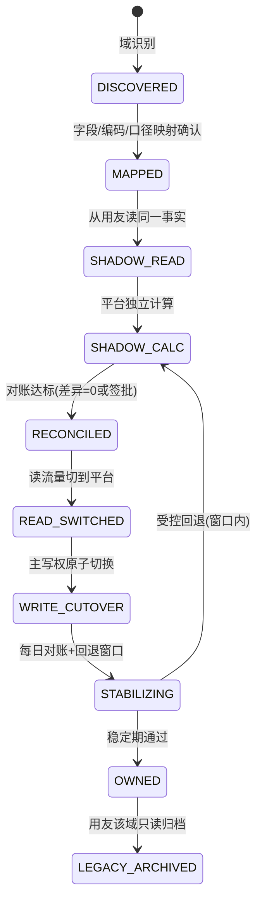

# 用友渐进替代路线与风险登记

> 版本：v1.0
> 日期：2026-07-19
> 依据：`workspace-evidence.md`、`product-strategy.md`、`target-architecture.md`
> 关键纪律：同一租户、同一业务域、同一时间只有一个记账主系统；无证据不断言用友版本

## 1. 执行摘要

1. "替代用友"必须拆成两步：**经营系统替代**（商品/销售/库存/采购/激励，财务留用友）与**完整 ERP 替代**（含总账）。当前全部证据只支撑前者；后者在拿到财务样本和会计政策前只是架构上限，不是承诺。
2. 替代顺序由数据证据决定：**主数据 → 销售（含退货/换机/分摊）→ 库存 → 采购 → 应收应付 → 存货核算与总账**。每一域走完"影子→对账→切换→稳定→归档"状态机，退出门槛不过就不切。
3. 避免长期双写的手段：`system_of_record_registry` 强制写命令检查主权；影子期只算不写；切换后旧系统该域即转只读；双写只允许存在于切换窗口（天级），不允许成为运行常态。
4. 财务替代的硬约束（复式记账/子账/成本/关账）按 docs §10 全部继承，并补充两条实证约束：单据可变性（版本链/冲销）与成本数据缺失（底表先行）。
5. 当前最严重风险按序：凭据与 PII 泄露（P0，已定位）＞ 历史事实被事后修改且基数随时间扩大 ＞ 提成底表缺失导致激励域封顶 ＞ 用友信息全黑盒。

## 2. 替代的两层含义（先定义终点）

| 层 | 范围 | 当前可行性 |
|---|---|---|
| 经营系统替代 | 主数据、销售/退货/换机/分摊、库存/序列号、采购、目标、提成 | 销售/库存/激励证据充分；采购仅"在途列+京东 TSV"弱证据，需补样本 |
| 完整 ERP 替代 | 应收应付、资金、存货核算、总账、期间关账、税务 | **零证据**。需：财务单据样本、科目表、成本计价方法、关账流程、财务负责人 |

决策点（需用户拍板）：终点停在哪一层。建议路线按"经营替代为必达目标、财务替代为条件触发"规划。

## 3. 替代状态机（每个业务域独立走一遍）

状态纪律：

- `SHADOW_*`：平台只计算、只对账，不产生任何外部效力；差异进工作队列，**禁止用 Excel 手工覆盖后宣称通过**（workspace 时代的手工改数习惯必须在此终结）。
- `WRITE_CUTOVER`：冻结范围与时间窗 → 导入期初+未完成单据 → 最终增量同步+余额核对 → 原子切主权 → 用友侧该域停止录入。
- `STABILIZING`：回退窗口（建议 ≥1 个完整业务周期，激励域 ≥1 个提成结算月）内保留受控反向迁移；窗口外回退需重新立项。

## 4. 问题 10：逐模块接管顺序与反双写

### 4.1 顺序与依据

| 阶段 | 域 | 接管依据（证据） | 前置条件 |
|---|---|---|---|
| A | 防腐层+统一读取 | 5 种销货结构+3 种现存结构已枚举，模板可覆盖 | 期 1（可信数据层）完成 |
| B | 商品/组织主数据 | 编码跨表不一致、名称即主键、分组时变——平台 ID 必须先立 | A |
| C | 销售+退货/换机+分摊 | 74 个文件、退货月均 ~¥20-36 万、换机月 80-105 单、分摊规则成熟 | B |
| D | 库存+序列号 | 19 个现存快照+1.1 万序列号行；快照/流水/预警口径已验证 | C |
| E | 采购 | 仅京东 TSV+在途列，证据弱 | 补采购/供应商样本后立项 |
| F | 应收应付/资金 | 零证据 | 财务样本+会计政策确认 |
| G | 存货核算+总账 | 零证据 | 完整影子月结 ≥1 周期 |

### 4.2 反双写机制

1. `system_of_record_registry(tenant, domain, owner_system, mode, effective_at, rollback_until)`：所有写命令前置检查，非主权方写请求直接拒绝。
2. 切换窗口内的临时双写必须有**自动对账任务**（数量/金额/余额三级），窗口以天计、以签批关闭。
3. 用友侧关闭写入口是退出 `STABILIZING` 的必要条件——只要旧入口还开着，双写事实就会继续产生（7.4/7.5 事后改单证明旧系统的数据会变）。
4. 每个域切换后，Excel 导出该域的通道同步退役，避免"系统切了、文件还在飞"的影子双轨。

## 5. 问题 11：完整替代时财务系统的硬约束

继承 docs §10 并标注实证来源：

1. **复式记账**：已过账凭证借贷必相等；Decimal+显式舍入（提成表已出现 7841.950000000001 浮点尾数的反面教材）；已过账凭证不可改，只能冲销/更正。
2. **子账=总账控制科目余额**：库存数量账=流水累计、库存金额账=存货核算累计、应收/应付子账=往来余额；不平即阻断关账，不接受人工备注解释。
3. **期间控制**：单据日期/业务日期/过账日期三分离；已关期间禁普通用户补改；反结账=高风险审批+职责分离+全审计。
4. **存货成本**：计价方法（移动平均/月末平均/FIFO）必须由企业会计政策确认——当前 workspace **无任何成本数据**（滞销金额都算不出），成本域必须以提成底表/进价数据先行落地，否则财务替代无从谈起。
5. **单据可变性**（本调研增补）：用友允许事后改单（实证），新平台从第一天起只允许"新版本+冲销"，这条不变量若失守，财务层全部对账承诺作废。

## 6. 问题 12：最严重的安全、隐私与迁移风险

### 6.1 安全与隐私（位置详见 workspace-evidence §8）

| 风险 | 级别 | 处置 |
|---|---|---|
| 飞书 app_secret 硬编码（2 脚本）+ LLM_API_KEY 明文 + 京东账号密码明文（2 处文档） | P0 | 立即轮换全部三类凭据；迁移至环境变量/密钥管理； secret scan 入 CI |
| workspace 在 git 工作树且无 .gitignore | P0 | 立即加 .gitignore 与数据保护规则；评估历史是否已提交 |
| 客户手机号/住址明文（50+ 文件+filtered_data.json+提成表） | P0 | 存储加密、字段级脱敏、下载审计、留存期限 |
| Prompt Injection 结构性暴露（日记尾指令样本；Agent 依赖读文件指令工作） | P1 | 数据/指令分区、工具参数结构化校验、注入样本入评测集 |

### 6.2 迁移风险

1. **历史事实漂移风险**：拖延越久，"用友现值"与"已发报表"背离越多（7.5 已差 ¥10,472 且无法闭环），期初余额的"可信起点"越难确立——这是尽快落地版本链的最强理由。
2. **提成底表缺失**：激励域封顶在"试算"，且成本域缺根。不解决则采购成本、毛利、财务存货核算全部连锁受阻。
3. **用友黑盒**：版本/接口/模块全未知；导出模板漂移（5 种表头）说明上游配置在被改动，映射层须按"模板会持续变化"设计。
4. **人的迁移**：数据发送人、导购（看日报）、用户（下指令）的工作流同时改变；平台若只是"另一个要维护的东西"会被弃用——期 2 退出条件（连续 2 周不用临时脚本）即为防此。
5. **多 Agent 无协调**：存在另一业务 Agent，职责未知；若多 Agent 各自维护口径，规则漂移会在平台外继续发生。

## 7. 验收指标（替代专项）

| 维度 | 门槛 |
|---|---|
| 对账 | 切换域数量/金额/余额差异=0 或有签批，连续 ≥2 周 |
| 主权 | 任一时点每域 `owner_system` 唯一；非主权写请求 100% 被拒 |
| 双写 | 切换窗口外双写=0；窗口内双写 100% 有自动对账 |
| 审计 | 任一事实可追到来源批次、规则版本、操作者、过账结果 |
| 财务 | 切换前完成 ≥1 个完整期间影子月结，试算平衡+子账总账核对通过 |
| 回退 | 回退演练通过，窗口与责任人书面明确 |
| 归档 | 用友停用后历史只读可查、审计资料可导出 |

## 8. 待用户确认清单（按决策阻塞度排序）

1. **替代终点**：经营系统替代（推荐先达）还是完整 ERP 替代。
2. **用友盘点**：产品/版本/部署/模块/接口；能否提供只读库或管理员配合导出。
3. **提成底表**：来源文件、维护人、能否导入平台。
4. **财务样本**：科目表、成本计价方法、一组凭证/应收应付样本（仅当终点含财务）。
5. **组织权威源**：D 组名单、滞销清单的维护责任人与变更流程。
6. **样本补齐**：采购/批发/换机/残机/赠品返利单据，6.11 与 0706 原始文件。
7. **另一业务 Agent 的边界**：是否接触同一经营数据，如何统一口径。
