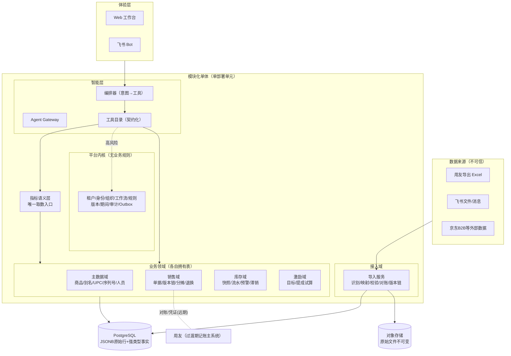
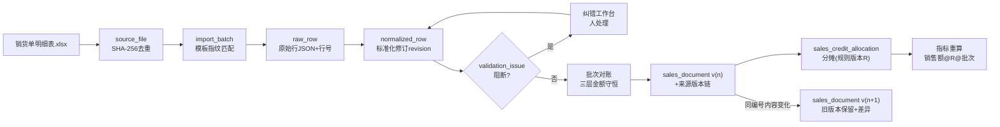
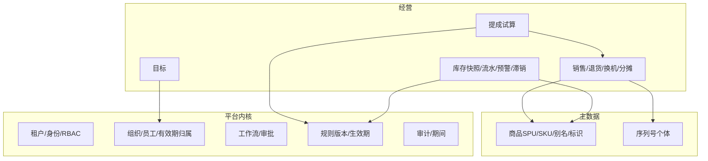

# 目标架构：领域边界、数据模型与 Agent 设计

> 版本：v1.0
> 日期：2026-07-19
> 依据：`workspace-evidence.md`、`product-strategy.md`
> 原则：模块化单体优先；跨模块只走公开 API/版本化事件；Agent 不碰正式事实

## 1. 执行摘要

1. 架构形态：**单部署单元的模块化单体 + 后台 Worker**，模块即领域（导入/主数据/销售/库存/激励/平台内核/智能层）。无真实拆分证据，不建微服务。
2. 数据模型核心增量（对 docs 的修正）：销售单据带**来源版本链**（事后改单显式化）、`document_relation` 承载退货/换机关系、规则全部版本化带有效期。
3. 血缘模型：`指标结果 ← 规则版本 ← 标准事实 ← 标准化修订 ← 原始行 ← 文件批次`六层，每层可独立重算。
4. Agent 边界：理解/查询/解释/草稿归 Agent；金额、库存、提成、状态转换、写库归确定性服务；高风险动作一律"草稿→校验→审批→执行→审计"。
5. 技术裁决：**不需要 LangChain 框架本体；LangGraph 暂缓**（审批等待用 DB 状态机即可）；**RAG 需要但仅限非结构化文档**；**规则引擎需要**，形态是"版本化规则数据 + 受限 DSL + 确定性求值器"，不是 RETE 通用引擎。

## 2. 总体架构



关键边界：

- Excel/附件/备注/历史记忆一律为不可信数据，只在接入域解析，内容永远不能成为运行时指令（workspace 日记末尾即存在注入样本）。
- 页面、Bot、Agent **都只能**从指标语义层取经营数字——workspace 里"5 处完成率错误实现"就是页面各写一套逻辑的实证后果。
- 跨模块：域内 DB 事务强一致；跨域走 Outbox 版本化事件 + Inbox 幂等消费；禁止跨模块写表。

## 3. 数据流（以一个销货 Excel 为例）



对账恒等式（提交前必须成立）：

```text
原始净金额 = 标准单据净金额 = 分摊金额合计
原始行数   = 通过行 + 跳过行 + 异常行
```

## 4. 问题 5：血缘保存方案

六层血缘，每层有稳定 ID 和指向上游的外键【建议】：

| 层 | 表 | 回答的问题 |
|---|---|---|
| 1 原始文件 | `source_file`（哈希/对象地址/上传者/来源消息） | 数据从哪来 |
| 2 批次 | `import_batch`（模板版本/状态/幂等键）+ `batch_relation`（重复/替代/覆盖） | 这批是什么、与上批什么关系 |
| 3 原始行 | `raw_row`（行号+单元格数组 JSONB） | 原始值是什么 |
| 4 标准化修订 | `normalized_row` + `data_correction`（原值/修正值/理由/操作者） | 被谁改过、为什么 |
| 5 标准事实 | `sales_document(+version)` / `inventory_snapshot` / `inventory_movement` | 正式事实及其演进 |
| 6 规则与指标 | `*_policy_version`（有效期/发布状态）+ `metric_result`（指标版本/输入版本/批次引用） | 数字按哪版规则、哪批数据算出 |

约束：

- 事实不可被报表逻辑覆盖；重算只产生新 revision/metric_result，不 UPDATE 历史。
- 指标回答必须携带 `(metric_version, rule_version, batch_range)` 三元组。
- 已知教训直接转为约束：完成率必须引用"累计口径"指标版本（5 处单日口径实证）；滞销必须引用清单版本（5 版清单漂移实证）。

## 5. 问题 8：领域设计

### 5.1 领域地图（当前业务）



### 5.2 核心实体（增量与修正处加 ★）

| 域 | 实体 | 要点 |
|---|---|---|
| 租户/组织 | `tenant` `org_unit` `employee` `employee_assignment` | ★归属带有效期——D 组 5 版名单实证"分组是时变数据"，历史重算必须能按当时归属 |
| 商品 | `product` `sku` `product_alias` `product_identifier` `serialized_item` | ★别名带来源范围和确认状态；匹配顺序=来源编码→UPC→确认别名→标准化型号→人工确认，终结"名称即主键+正则猜型号"；★UPC 非唯一（实证），只作候选不作键 |
| 销售 | `sales_document` `sales_document_line` `sales_document_version`★ `document_relation`★ `sales_credit_allocation` | ★版本链：同单据编号新批次内容变化→新版本+差异记录（7.4/7.5 实证）；★`document_relation` 显式承载退货↔原销售、换机正负单（月均 80-105 对）；分摊与原始业务员字段分开保存，分摊合计=明细金额 |
| 库存 | `warehouse` `inventory_snapshot` `inventory_movement` `inventory_alert` `stagnant_list_version`★ | 快照回答"现在多少"、流水回答"为什么"；★滞销清单作为版本化规则数据（非代码、非阈值），沿用"人工清单只看台数"现实 |
| 激励 | `sales_target(version)` `cost_basis`★ `commission_policy_version` `commission_calculation` `commission_result` | ★`cost_basis`=提成"底表"的一等模型（当前底表缺失是最大缺口）；规则含已逆向参数：利润提成 10%、小家电 2%、计件标准按品类 |
| 导入 | 见 flexible-excel-import-design.md §9 | 增补：`import_batch` 需记录解析代码版本 |
| 智能 | `agent_run` `tool_call` `action_draft` `approval_instance` `audit_event` | 见 §6 |

### 5.3 现在不能建的域【证据边界】

采购、应收应付、总账、售后、CRM——workspace 零数据样本。架构只预留边界（内核/事件/ID 体系），不建表、不建流程。

## 6. 问题 6：Agent / 确定性服务 / 人工审批的边界

### 6.1 三方职责

| 方 | 拥有 | 禁止 |
|---|---|---|
| Agent | 意图理解、查询编排、异常解释、证据汇总、**草稿**生成、映射建议 | 任意 SQL；直接写正式事实；决定金额/库存/提成终值；接受对账差异；从附件文本取指令 |
| 确定性服务 | 全部金额/数量/库存/提成计算、状态机、权限、写库、对账 | 调用 LLM 参与计算路径 |
| 人（有权限角色） | 模板发布、映射确认、阻断异常处置、高风险审批、规则发布、期初/关账类决策 | （系统须防止）无审计地改事实 |

### 6.2 高风险动作统一管道

```text
Agent/用户发起 → action_draft(参数schema校验+权限预检)
  → 确定性校验(守恒/状态机/影响面预览)
  → approval_instance(角色+职责分离)
  → 执行(幂等键+事务)
  → audit_event(前后值+规则版本+操作者)
```

适用清单【按风险实证排序】：提成试算确认、分摊重算、批量修正、模板发布、规则发布、滞销任务指派、（远期）补货单/过账/主权切换。

### 6.3 工具契约（每个工具必填）

用途与不适用场景 / Pydantic 输入 Schema / 角色与数据范围 / 幂等键 / 风险级与审批要求 / 结构化输出+证据引用 / 超时错误码 / 审计与脱敏规则。

### 6.4 评测方案

- 离线评测集 ≥50 问，全部来自真实纠错史：净额 vs 正额、二人组拆分、空调套数、滞销清单版本、完成率口径、负卖+在途覆盖。
- 断言项：数字与指标层一致、引用三元组齐全、拒答任意 SQL 类请求、注入文本（日记尾样本）不改变行为。
- 每次规则发布、模型更换、提示变更前全量回归；线上 tool_call 抽样审计。

## 7. 问题 7：LangChain / LangGraph / RAG / 规则引擎裁决

| 技术 | 裁决 | 理由 |
|---|---|---|
| LangChain | **不需要** | 所需只是"模型调用+工具循环"，直接基于 SDK 实现百行内可控；引入框架只增依赖与黑盒。docs spec §11 将其写入基线属过早绑定 |
| LangGraph | **暂缓，有明确触发条件** | 其核心价值是长流程暂停/恢复的状态持久化——本平台的"等待审批"由 `approval_instance` 状态机承担（本来就必须落库）。触发条件：出现 ≥3 步且需跨会话恢复、含分支补偿的 Agent 流程（如迁移对账向导）时再引入 |
| RAG | **需要，严格限定范围** | 仅用于非结构化资料：规则文档、SKILL 口径说明、品牌型号手册、历史纠错记录。结构化交易数据一律走指标层——RAG 不替数据库（本项目铁律）。检索空间按租户+角色过滤，内容与指令分区 |
| 规则引擎 | **需要，但自研受限形态** | 需求实证：分组/目标/滞销清单/提成/排除项全部在漂移，且需要"按历史规则重算"。形态=规则即版本化数据（生效期+发布状态）+ 受限 DSL/决策表 + 确定性求值器 + 黄金样本回归。**不引入 Drools 类通用引擎**，禁止租户上传任意代码 |

## 8. 问题 9：远期模块扩展机制（CRM/售后/WMS/SRM/OMS）

扩展靠三条既有机制，不加新范式【建议】：

1. **平台内核复用**：租户/组织/工作流/规则/审计/事件骨架已为任意新域就绪；新域=新模块+新表+订阅内核服务，符合"两域以上共享且语义一致才进内核"的守门规则。
2. **主数据 ID 先行**：CRM 需要的 `customer_id`、售后需要的 `serialized_item`、WMS 需要的 `warehouse/序列号`，在 MVP 模型中已存在或以种子形态存在——远期模块挂接的是已有 ID，不是另建客户库。
3. **事件契约**：如 `sales.sale_completed.v1` → CRM 更新购买历史；`crm.opportunity_won.v1` → 销售域建草稿。事件只陈述已发生事实。

启动门槛（任一不满足不动工）：核心域对账达标；有真实流程与样本（非想象）；事实所有权无冲突；可定义量化退出条件。**当前 MVP 不包含其中任何一个模块**——workspace 对 CRM/售后/WMS/SRM/OMS 的证据为零（仅有的序列号表只支撑售后"设备-序列号"种子）。

## 9. 技术基线（最小集）

Python/FastAPI/Pydantic/SQLAlchemy/Alembic + PostgreSQL（JSONB 存原始行，强类型表存事实，Decimal 算金额）+ S3 兼容对象存储 + Worker（导入/重算/对账）+ Next.js 前端；依赖管理 uv/pnpm。Redis/Temporal/消息中间件一律等真实瓶颈出现再引入（YAGNI）。
